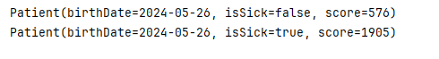

# Application ORM avec Spring Data JPA

Cette activité présente une application Spring Boot utilisant Spring Data JPA pour la gestion des données persistantes. L'application met en œuvre un modèle d'entités pour gérer les informations des patients, des médecins, des consultations et des rendez-vous.

## 1. Modèle d'entités

L'application utilise les entités suivantes :

* **Person**: Classe abstraite représentant une personne avec les attributs suivants :
    * id: Identifiant unique de la personne (clé primaire)
    * firstName: Prénom
    * lastName: Nom de famille
    * email: Adresse email (unique)

* **Patient**: Classe héritant de Person, représentant un patient avec les attributs suivants :
    * birthDate: Date de naissance
    * isSick: Indique si le patient est malade
    * score: Score du patient
    * appoitements: Liste des rendez-vous du patient (relation OneToMany)

* **Doctor**: Classe héritant de Person, représentant un médecin avec les attributs suivants :
    * speciality: Spécialité du médecin
    * appoitements: Liste des rendez-vous du médecin (relation OneToMany)

* **Consultation**: Classe représentant une consultation avec les attributs suivants :
    * id: Identifiant unique de la consultation (clé primaire)
    * date: Date de la consultation
    * report: Rapport de la consultation
    * appoitement: Rendez-vous associé à la consultation (relation OneToOne)

* **Appoitement**: Classe représentant un rendez-vous avec les attributs suivants :
    * id: Identifiant unique du rendez-vous (clé primaire)
    * date: Date du rendez-vous
    * stat: État du rendez-vous (PENDING, COMPLETED, CANCELED)
    * patient: Patient associé au rendez-vous (relation ManyToOne)
    * doctor: Médecin associé au rendez-vous (relation ManyToOne)
    * consultation: Consultation associée au rendez-vous (relation OneToOne)

### 2. Repositories

L'application utilise des interfaces de repositories pour accéder aux entités persistées. Les interfaces suivantes sont définies :

* **PersonRepository**: Interface générique pour les opérations CRUD sur les entités Person, avec des méthodes spécifiques pour rechercher par email, nom de famille, prénom ou les deux.

* **PatientRepository**: Interface héritant de PersonRepository, avec des méthodes spécifiques pour rechercher les patients malades.

* **DoctorRepository**: Interface héritant de PersonRepository, avec des méthodes spécifiques pour rechercher les médecins par spécialité.

* **AppoitementRepository**: Interface pour les opérations CRUD sur les entités Appoitement, avec des méthodes spécifiques pour rechercher les rendez-vous entre deux dates.

* **ConsultationRepository**: Interface pour les opérations CRUD sur les entités Consultation.

### 3. Configuration et Démarrage

L'application Spring Boot est configurée avec Spring Data JPA pour gérer les entités et les repositories. Le fichier `application.properties` contient les configurations nécessaires à la connexion à la base de données MySQL. Le fichier `OrmActivityApplication.java` définit la classe principale de l'application, qui contient un bean `CommandLineRunner` pour peupler la base de données avec des données de test.

Le fichier `OrmActivityApplication.java` contient des exemples d'utilisation des repositories et des méthodes spécifiques. Le code suivant montre comment la saisie des nouveaux patients et docteurs, et rechercher des patients par prénom ou nom de famille contenant "Mo".

```java
Stream.of("Mohamed", "Hassan", "Mouad", "Yassmine", "Doha", "Oussama", "Ammar", "Anas", "Yaacoub").forEach(name -> {
Patient patient = new Patient();
    patient.setFirstName(name);
    patient.setLastName(name);
    patient.setEmail(name + "@gmail.com");
    patient.setSick(Math.random() > 0.5);
    patient.setScore((int) (Math.random() * 3000));
    patient.setBirthDate(new Date());
    patientRepository.save(patient);
});

Stream.of("Amine", "Abdelmajid", "Issam", "Ibrahim", "Youssef", "Bilal", "Wissam", "Jiahd", "Sanae", "Intissar", "Hafsa", "Manal", "Montassir", "Zineb", "Fatima", "Ayoub").forEach(name -> {
    Doctor doctor = new Doctor();
    doctor.setFirstName(name);
    doctor.setLastName(name);
    doctor.setEmail(name + "@gmail.com");
    doctor.setSpeciality(Math.random() > 0.5 ? "Urgence" : "Cardiologie");
    doctorRepository.save(doctor);
});

patientRepository.findByFirstNameOrLastNameContains("Mo", "Mo").forEach(System.out::println);
```


